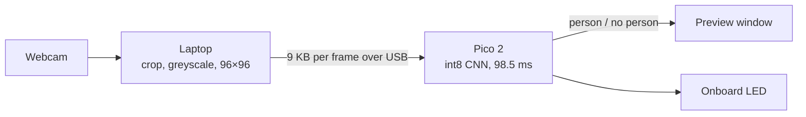

# pico-person-detection

**Is there a person in front of the camera?** A small neural network on a Raspberry Pi Pico 2 - a
microcontroller with 520 KB of RAM and no operating system - answers that about eight times a second
from a live webcam.

The laptop does the camera work: it crops each frame to 96×96 greyscale and streams it over USB. The Pico
runs the int8 model with TensorFlow Lite Micro and answers person / no person, over USB and on its onboard
LED. It reports presence only, not where the person is; the name comes from the TensorFlow Lite Micro
`person_detection` example the project started from.



## Results

| Model | Test accuracy | Inference on the Pico | Model size | Arena (RAM) |
|---|---|---|---|---|
| Pretrained TFLM person detection (baseline) | 76.1% | 98.6 ms | 294 KB | 80 KB |
| **Ours: MobileNet v1, α=0.25** (default) | 76.1% | 98.5 ms | 296 KB | 80 KB |
| Ours: MCUNet, α=0.6 (optional) | **77.9%** | 198.8 ms | 295 KB | 173 KB |

- **Live:** 8.4 frames per second and 129 ms from capture to verdict, with the Pico's outputs matching a
  host reference bit-exactly.
- **Trained from scratch** on 80,000 Wake Vision images, our MobileNet v1 matches the pretrained model.
  MCUNet beats it by 1.9 points (paired test, p = 1.2e-4) at twice the inference time.
- **Twice as fast as out of the box:** splitting the CMSIS-NN kernels across both cores and running the
  model from SRAM took inference from 190 ms to 99 ms.

Accuracy is int8 on a balanced 9,000-image Wake Vision test split; inference time is the Pico's own
measurement. How every number was obtained is in [the journal](docs/journal/).

## Quick start

You need a Raspberry Pi Pico 2 and a machine with a webcam, running Linux or WSL2. The project is developed
on WSL2, where the Pico and the webcam are attached with [usbipd-win](https://github.com/dorssel/usbipd-win).

```bash
git clone --recursive https://github.com/KrystofBo/pico-person-detection.git && cd pico-person-detection
conda env create -f environment.yml && conda activate pico-person-detection

# Firmware with the default model; toolchain and picotool setup: docs/journal/01-toolchain-hello.md
export PICO_TOOLCHAIN_PATH=<arm-gnu-toolchain directory>
cmake -S firmware -B firmware/build -Dpicotool_DIR=<picotool>/lib/cmake/picotool
cmake --build firmware/build -j8 --target person_detect_serial_custom
picotool load -f -x firmware/build/person_detect_serial/person_detect_serial_custom.uf2

python tools/webcam_pico.py     # live preview; q to quit
```

The full procedure, with troubleshooting, is in the [live-webcam guide](.claude/skills/live-webcam/SKILL.md).

## Repository

| Path | Contents |
|---|---|
| `firmware/` | Pico firmware: `person_detect_serial` answers frames sent over USB, `person_detect_profile` times each operator |
| `tools/` | Host scripts: the live demo, image streaming, a bit-exact host reference, the dataset builder |
| `training/` | Keras training and int8 conversion: MobileNet v1, with MCUNet and MobileNetV3 as options |
| `models/` | The default model, `v1-80k.tflite` |
| `docs/journal/` | One write-up per step: what was built, what was measured, what went wrong |
| `results/` | Raw measurements behind the numbers above |
| `third_party/` | Pinned pico-sdk and pico-tflmicro submodules |

## Project log

| Step | What | Journal |
|---|---|---|
| 00 | Repository, conventions and docs | [00](docs/journal/00-project-setup.md) |
| 01 | Toolchain and a first firmware on the Pico 2 | [01](docs/journal/01-toolchain-hello.md) |
| 02 | The pretrained TFLM model on the Pico, sped up from 190 to 99 ms | [02](docs/journal/02-tflm-embedded.md) |
| 03 | A host reference and USB image streaming, bit-exact with the Pico | [03](docs/journal/03-host-reference-streaming.md) |
| 04 | Our own models, trained on 80,000 Wake Vision images | [04](docs/journal/04-train-our-model.md) |
| 05 | The live laptop webcam, streamed to the Pico | [05](docs/journal/05-live-webcam.md) |

## Development

- The project is built in numbered steps, each with its own branch, tag and journal entry. The conventions
  are in [CLAUDE.md](CLAUDE.md); step-by-step procedures - building and flashing, the Python environment,
  the live demo - are in [`.claude/skills/`](.claude/skills/).
- `third_party/pico-tflmicro` is patched at build time with dual-core CMSIS-NN kernels
  (`third_party/patches/`), so git always shows it as modified. Don't commit the submodule pointer.
